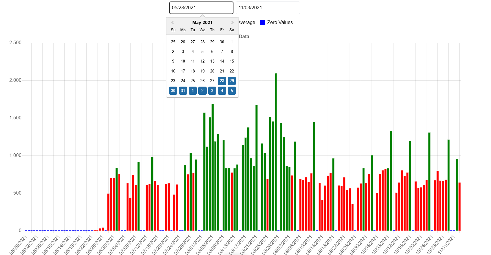
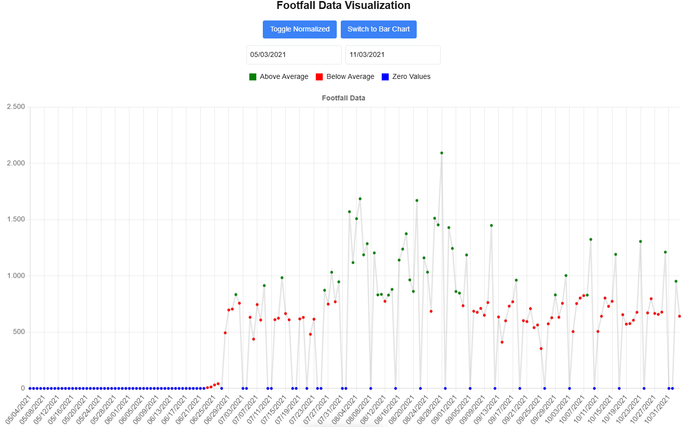
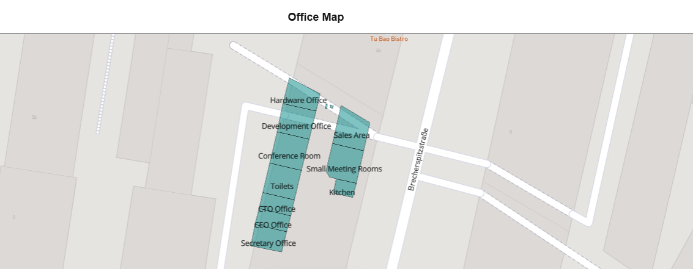

# Footfall Visualization App

## Table of Contents

- [Introduction](#introduction)
- [Technologies Used](#technologies-used)
- [Minimum Requirements](#minimum-requirements)
- [Setup Instructions](#setup-instructions)
- [Running the Application](#running-the-application)
- [Features](#features)
- [Testing](#testing)
- [Design Choices and Approach](#design-choices-and-approach)

## Introduction

The Footfall Visualization App is a data visualization tool built in **Next.js** that renders data from a CSV file to visualize footfall trends. The app allows users to filter data by date range, toggle between raw and normalized data, and switch between chart types. Additionally, it features a map with geospatial data using **Mapbox GL**.

You can check out the live demo of the application [here](https://ariadne-trial.vercel.app/).

## Technologies Used

### Core Libraries

- **Next.js** - Provides server-side rendering and built-in optimization.
- **React** and **TypeScript** - Used for building reusable, maintainable components.
- **Tailwind CSS** - Ensures responsive and efficient styling.
- **Mapbox GL** - Chosen for its high-performance, interactive mapping capabilities, making it ideal for handling geospatial data efficiently.
- **Chart.js** with **React Chart.js 2** - Used for data visualization due to its low load time and robust charting capabilities, allowing dynamic rendering of line and bar charts with minimal performance overhead.

### Development Tools

- **ESLint** and **Prettier** - For code consistency and formatting.
- **Jest** and **React Testing Library** - For unit and integration testing.

## Minimum Requirements

- Node.js v14 or higher
- npm v6 or higher

## Setup Instructions

1. Clone the repository:

```bash
git clone https://github.com/remre/ariadne_assignment.git
```

2. Install dependencies:

```sh
  cd ariadne_assignment
  npm install
```

3. Set up the environment variables. Create a .env file in the root directory and add your Mapbox access token:

```env
NEXT_PUBLIC_MAPBOX_ACCESS_TOKEN=your_mapbox_access_token
```

## Running the Application

To start the application in development:

```bash
npm run dev
```

Open http://localhost:3000 in your browser to view the app.

To build the application in production:

```bash
npm run build
```

## Testing

- The app includes unit and integration tests using Jest and React Testing Library to ensure data handling and rendering work as expected.

```bash
npm run test
```

This will execute all the test cases, ensuring the functionality is working as expected.

## Features

### Data Visualization

#### Chart Types

- **Bar Chart**: Displays daily footfall values.
- **Line Chart**: Shows trends over the selected date range.

#### Data Normalization

- **Raw Data**: Displays actual daily footfall values.
- **Normalized Data**: Adjusts data so the highest day reaches 100%, making trends easier to spot.
  - Note: The yearly average calculation excludes days with zero footfall to provide a more accurate trend representation. Since the provided CSV covers a full year, this approach gives a meaningful yearly average by disregarding days without foot traffic.

### Interactivity

- **Date Range Selection**: Users can select a specific date range to filter the data.
- **Chart Switching**: Toggle between bar and line charts seamlessly.



### Color Indicators

- **Green**: Footfall above the yearly average.
- **Red**: Footfall below the yearly average.
- **Blue**: Days with zero footfall.



### Geospatial Context

#### Map Integration

- **Map Integration**: Displays office and queue locations using Mapbox.
- **GeoJSON Data**: Renders areas with unique names on the map, providing spatial context to the footfall data.



## Design Choices and Approach

### Efficient Data Rendering and Reusability

- Components are organized with an **atomic design approach**, keeping small reusable parts separated from larger features. This makes future updates and modifications more manageable.

### Performance Optimization with Dynamic Imports

- **Dynamic Imports** are used for loading large components like maps and charts only when necessary, reducing the initial bundle size and improving the application’s load time and overall performance.

### Error Handling

- **Error Boundaries** are implemented to provide user-friendly error messages if data fails to load or an unexpected issue occurs, ensuring a smooth and graceful user experience.

### User-Friendly and Responsive Design

- **Tailwind CSS** was used to ensure that the application is fully responsive and visually consistent across devices.
